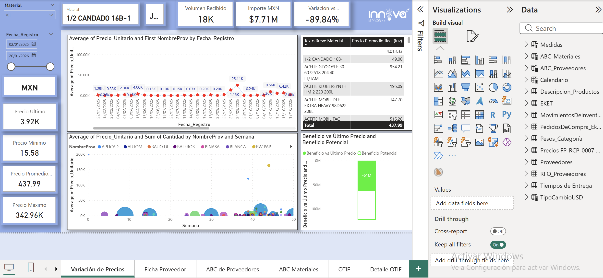

# Dashboard Compras de Refacciones - Power BI
Este repositorio tiene como objetivo documentar el tablero de compras de materia prima e insumos, con la estructura de conexiones, tablas, columnas calculadas y medidas utilizadas para la creación del modelo visual. 
---
## Objetivo
El tablero de pronóstico de moldeados tiene como objetivo dar seguimiento a la variabilidad de precios de compra, fichas de proveedor, ABC de materiales, proveedores, OTIF de proveedores, evaluaciones de calidad de proveedores, extractos para pago a proveedores, seguimiento al margen OCC, matriz de proveedores y matriz técnico ecónimica de desarrollo de nuevos proveedores. 
---
## Tecnologías Utilizadas
- **Power BI Desktop y Power BI App.com** ([modo de conexión: Import])
- **[Fuente de datos: SQL Server / SAP / Sharepoint Lists / Supabase / ]**
- **DAX** (*[tipo de cálculos: medidas de forecast, métricas de calidad, etc.]*)
- **GitHub** (para control de versiones y documentación técnica)
---
## Estructura del Repositorio
```plaintext
[Nombre_Repositorio]/
├── pbix/ ├── README.md ├── docs/
│ ├── Medidas.md │ ├── Columnas_Calculadas.md │ ├── Tablas_Calculadas.md │ └── video_tutorial.md ├── img/
│ ├── preview_dashboard.png │ └── modelo_datos.png → Archivos PBIX del tablero
→ Descripción general del repositorio
→ Medidas DAX documentadas
→ Columnas calculadas documentadas
→ Tablas calculadas documentadas
→ Guía de uso del dashboard
→ Captura del dashboard
→ Relación entre tablas
iii. ```
---
## Preview del Dashboard

